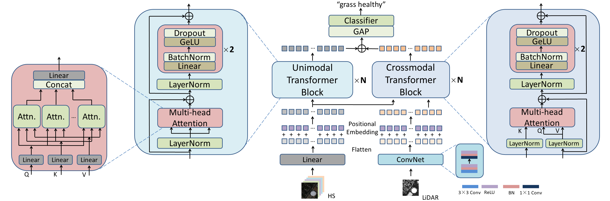

# ParT

This is the official repository for "Hyperspectral and LiDAR Data Land-Use Classification Using Parallel Transformers" (IEEE IGARSS 2022).

## Abstract

It has been proved that the fusion of hyperspectral and Li-DAR data can effectively improve the performance of land-use classification. Most recent models have novel architectures which treat hyperspectral and LiDAR data equally and convolutional neural networks are widely used for extracting features of hyperspectral data. We argue that we should pay more attention to hyperspectral data and improve feature extraction tools. This paper proposes a simple yet effective model with parallel transformers. Transformers are powerful in feature extraction and feature fusion. One transformer acts as a hyperspectral image feature extractor, while the other transformer is responsible for capturing cross-modal interactions. Experiments on Houston dataset and MUUFL Gulfport dataset demonstrate that the proposed model has significantly better performance than other state-of-the-art models.



## Environment

This project don't require any special python packages and only need some basic packages for deep learning, such as:

Pytorch (no restriction on version number)

Numpy

Sklearn

Tifffile

Pandas

## About the Dataset

I have uploaded the data files into my Google Drive. The links are as below:

MUUFL Dataset:

https://drive.google.com/file/d/1U9lSWNsUR1AoGLSPrhWGwLWlSHORN1hB/view?usp=share_link

https://drive.google.com/file/d/1lF0HsFjYXz9vaqvXNmTU2QH1nbf-0Z-c/view?usp=share_link

DFC2013 Dataset:

https://drive.google.com/file/d/10wY14nysnn5mHfAs5SS-4SHT15Myj1I1/view?usp=sharing

https://drive.google.com/file/d/1cOkjo8Bf0uN96PthbvQHgRBh36C3ZMcj/view?usp=sharing

## Citation

Please cite this paper if you want to use it in your work.

```
@INPROCEEDINGS{hu2022ParT,  
    author={Hu, Yuxuan and He, Hao and Weng, Lubin},  
    booktitle={IGARSS 2022 - 2022 IEEE International Geoscience and Remote Sensing Symposium},   
    title={Hyperspectral and LiDAR Data Land-Use Classification Using Parallel Transformers},   
    year={2022},  
    volume={},  
    number={},  
    pages={703-706},  
    doi={10.1109/IGARSS46834.2022.9884696}
}
```